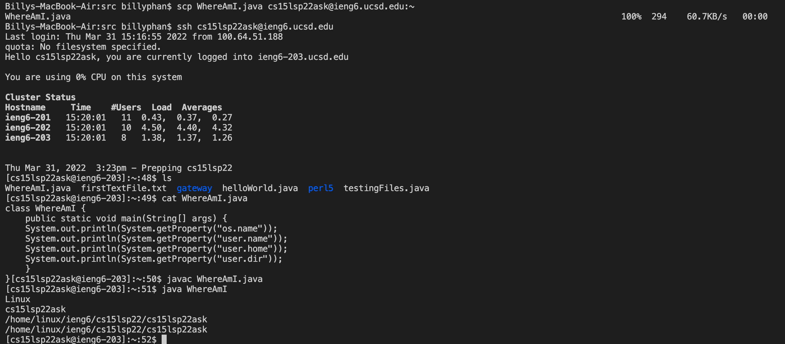

# CSE15L Lab report 1 | Week 2 
```
Written and Submitted By: Billy Phan
```

> **1) Installing VSCode**


* To install VSCode, I simply went to the internet, searched up "VSC download", and then downloaded the version that was compatable with my operating system and specs.

* I then made a file called `helloWorld.java` and made sure my IDE worked as I wanted.

---

> **2) Remotely Connecting**


* To connect to a remote computer, I used the linux command `ssh` (secure socket shell) followed by my school given ID (cs15lspr22ask@ieng6.ucsd.edu).

* I then entered my password when prompted to (a password must be entered everytime you want to remotely connect unless you set up a `ssh key`).

---

> **3) Trying Out Some Commands**


* In the provided picture, you may see me experimenting with some different linux commands.

* While experimenting I was able to make a new directory (using `mkdir`), create a new text file (using `touch`), and then put text into the actual text file (using `echo`).

---

> **4) Moving Files with `scp`**


* I first used the linux command `scp` to copy the file `WhereAmI.java` from the client (my laptop) to the remote server.



* I then ran the file `WhereAmI.java` that I passed to the server on the remote computer to check that the file was passed successfully. 

---

> **5) Setting up an `ssh` Key**


* I first got the keys from my client using the linux command `ssh-keygen`, then sent them to the server using `scp`


* After sending the keys to the remote server, I then was able to log onto the remote server without a password.

---

> **6) Optimize remote running**


* I was able to send the server a copy of a java file (`WhereAmI.java`) by only clicking 2 buttons: uparrow, and enter.

* To achieve this, I first typed out the commands into the terminal beforehand to test that it worked, and then, to "do it within two key strokes", I used the up arrow and enter.

* Side note*: up arrow allows for you to get to the last previously entered command in your terminal.