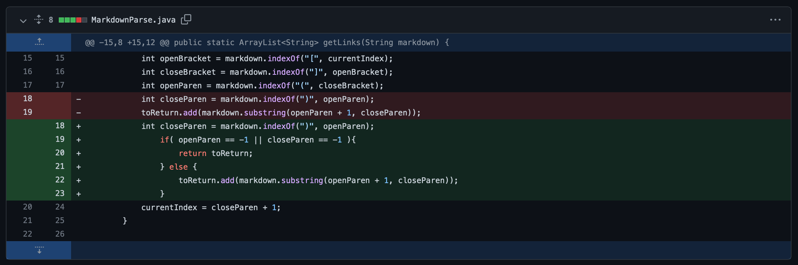
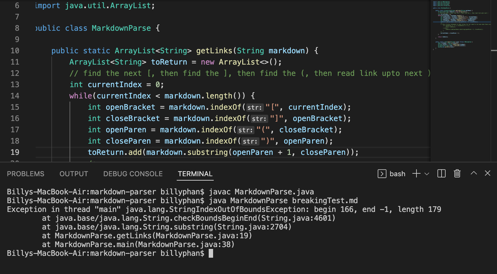

# CSE15L Lab report 2 | Week 4
```
Written and Submitted by: Billy Phan
```
---

```Code Change 1```

> First Code Diff: 



*See why we needed to make this change here:*
[Failure Inducing Symptom 1](https://github.com/b-ianphan/markdown-parser/blob/main/breakingTest.md)

> Output of Symptom:



> Explanation: 

Our code prior to fixing was essentially reading the index of `Closing Parenthesis: ")"` as "-1" (it couldn't be found), so when our program would take note of a link using `.add` there would be an `indexOutOfBoundsException` (Our symptom). This output only occurs when we pass to our program a `.md` file where we have a open paranthesis without a paired closing one `Ex: [...](...`.

---

```Code Change 2```

> Second Code Diff:


*See why we needed to make this change here:* [Failure Inducing Symptom 2]()

> Output of Sympton: 


> Explanation:

--- 

```Code Change 3```

> Third Code Diff:


*See why we needed to make this change here:* [Failure Inducing Symptom 3]()

> Output of Sympton:


> Explanation:


