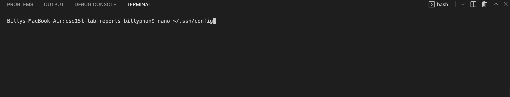
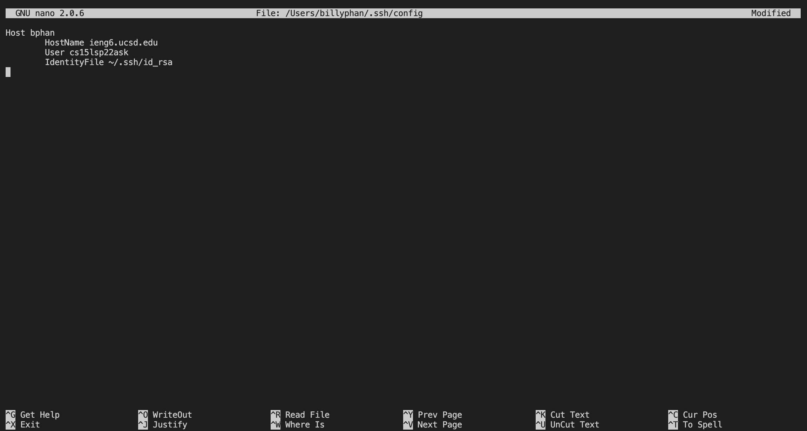
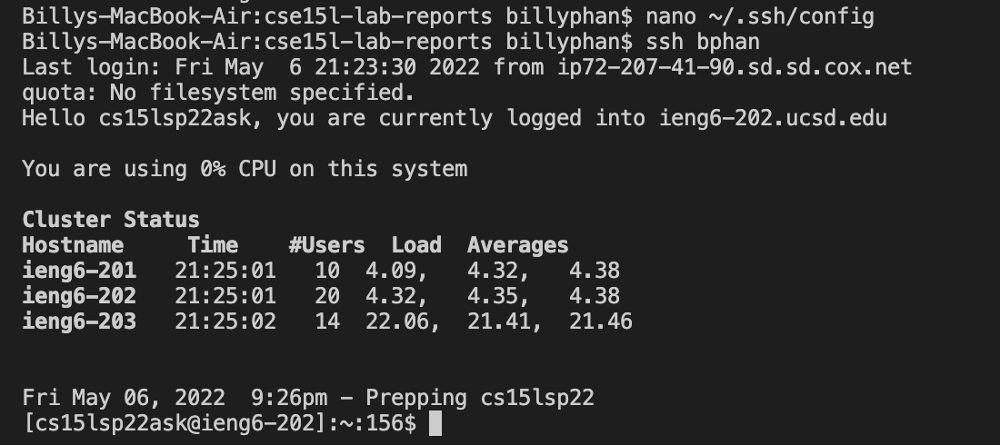
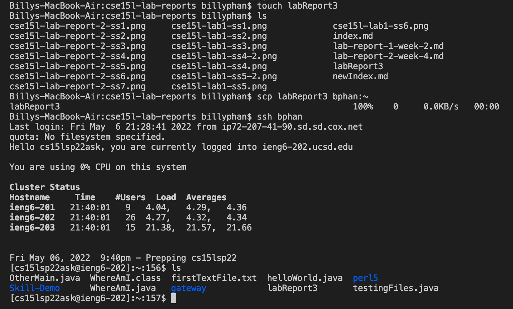
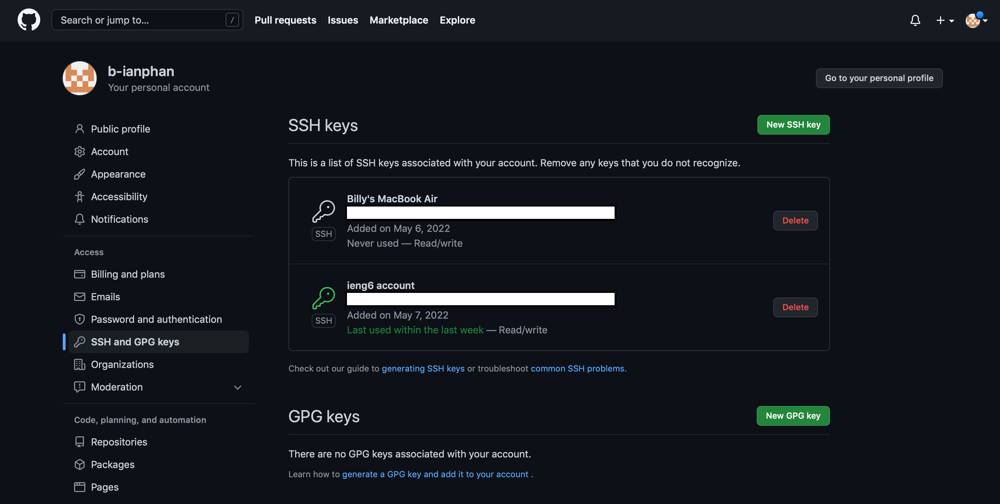
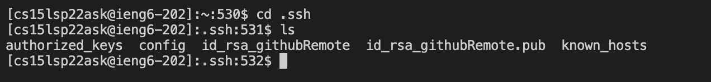
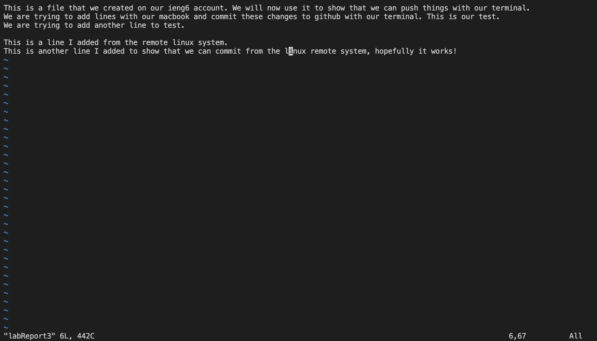
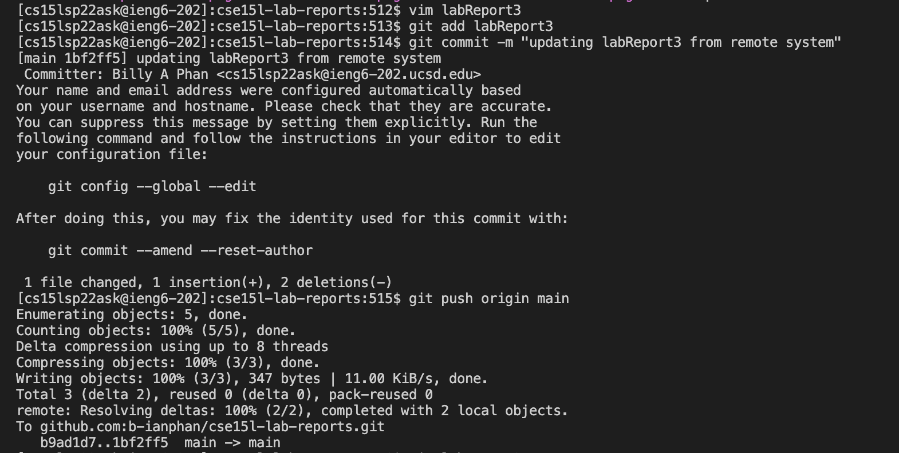

# CSE15L Lab Report 3 | Week 6

```
Written and Submitted by: Billy Phan
```

> **Task 1: Streamlining SSH Configuration**



* I first accessed my `ssh/config` file through `nano`.



* From there I added a host to be able to log into my ieng6 account with a simple alias `(bphan)`.



* As you can see above I was able to log into my remote host through an alias instead of having to type out the whole email. 



* I was then able to `scp` a file over using my alias instead of the email.

---

> **Task 2: Setting up Github Access from ieng6 acocunt**



* Here you can see where I have my `public keys` stored on my github account.



* Here you can see where I have my **public and private keys** stored on my remote account.
* To specificy: I am in my remote account and in the `.ssh` directory.



* This is a file that I created from my ieng6 account.
* What you should be paying attention to is the bottom lines that i've edited to show that I could commit from the linux remote system
* Since this was not my first attempt, I've simply edited the file instead of adding more lines.



* I used `git add [filename]`, `git commit -m "[message]"`, and `git push origin main` to get my file from the remote host to the repository.

[Link to commit for proof](https://github.com/b-ianphan/cse15l-lab-reports/commit/1bf2ff520d75c605b21d1d7e102f9aeaed45ce00)