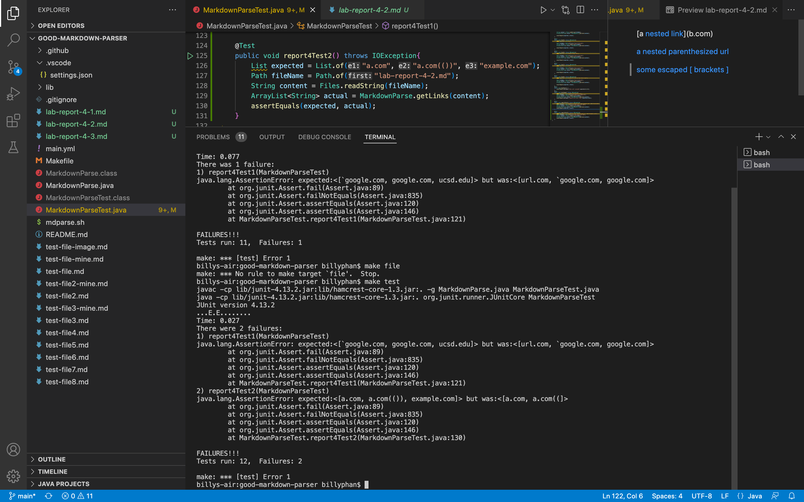

# CSE15L Lab report 1 | Week 2 
```
Written and Submitted By: Billy Phan
```
---
> **Prediction Of Test Results**

### Test 1


* According to the file preview, `Test 1` should produce the links "`google.com", "google.com", and "ucsd.edu".

### Test 2


* According to the file preview, `Test 2` should produce the links "a.com", "a.com(())", "example.com".

### Test 3


* According to the file preview, `Test 3` should produce the link "https://sites.google.com/eng.ucsd.edu/cse-15l-spring-2022/schedule".

---
> **Turning Test Files into Tests**

### Test 1 


### Test 2 


### Test 3 


---
> **My Implementation**

### Test 1 (failure)


### Test 2 (failure)


### Test 3 (failure)


---

> **Other Implementation**

### Test 1 (failure)


### Test 2 (failure)


### Test 3 (failure)


---
> **Explanations**

* Test 1: My and the other test 1 implementation can be fixed under 10 lines of code. I believe that I would simply need an `if statement` to check if theres an inline command before and after "[", and "]".

* Test 2: My and the other test 2 implementation cannot be fixed under 10 lines of code. I believe that I would need multiple statements `if statements`, as well as temporary variable holders in order to check for nested brackets and paranthesis. 

* Test 3: My and the other test 3 implementation can be fixed under 10 lines of code. I believe that I would just need a loop to check multiple lines if a symbol (`[,],(,)`) is not on the same line. 