# CSE15L Lab report 1 | Week 2 
```
Written and Submitted By: Billy Phan
```
---

* My Repository: [My repo](https://github.com/b-ianphan/markdown-parser.git)

* Other Repository: [Other Repo](https://github.com/nidhidhamnani/markdown-parser.git)

---

> **Running Markdown Parse on Command Lines**

### Running on My Repository
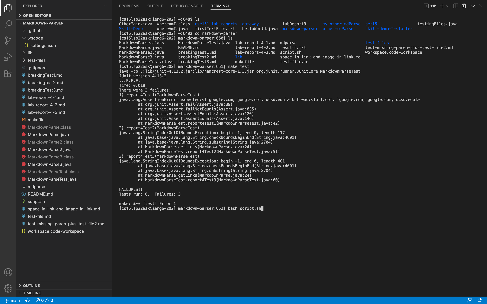
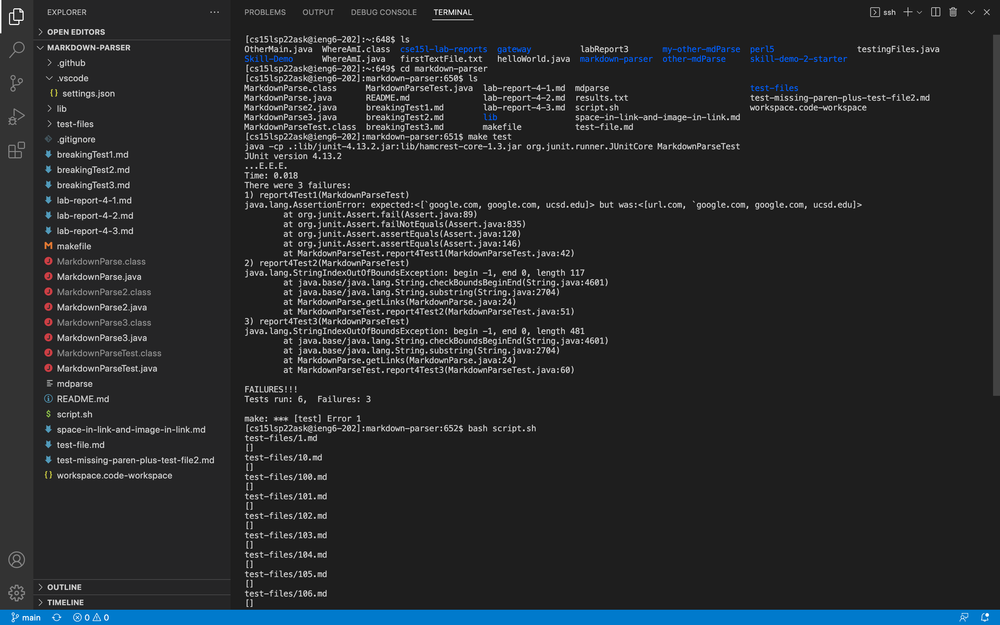

### Running on Other Repository 
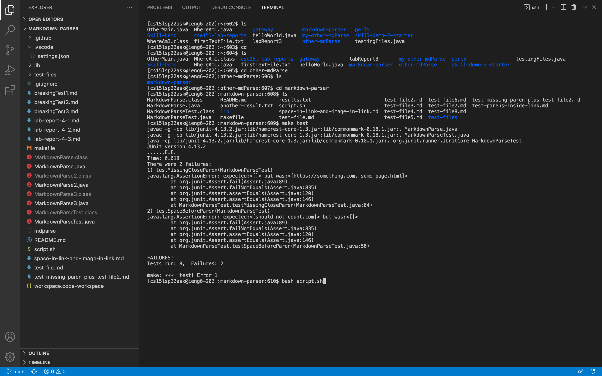
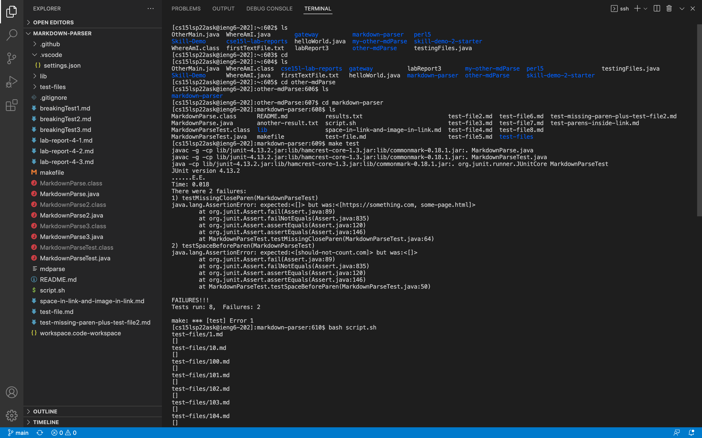

---

> **Finding Test With Different Results**

* To find my differing tests, I used `vimdiff`
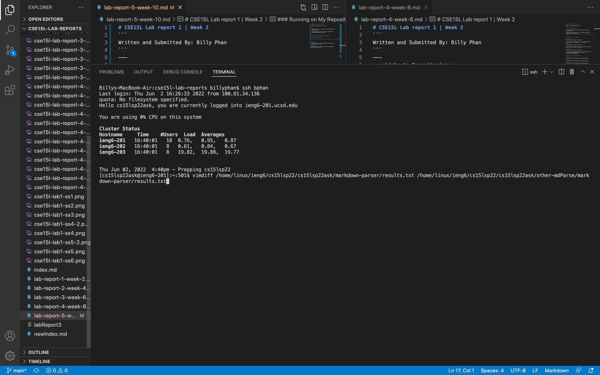

* I then went through the output, and looked at highlighted lines until I eventully reached Tests 502 and 519.

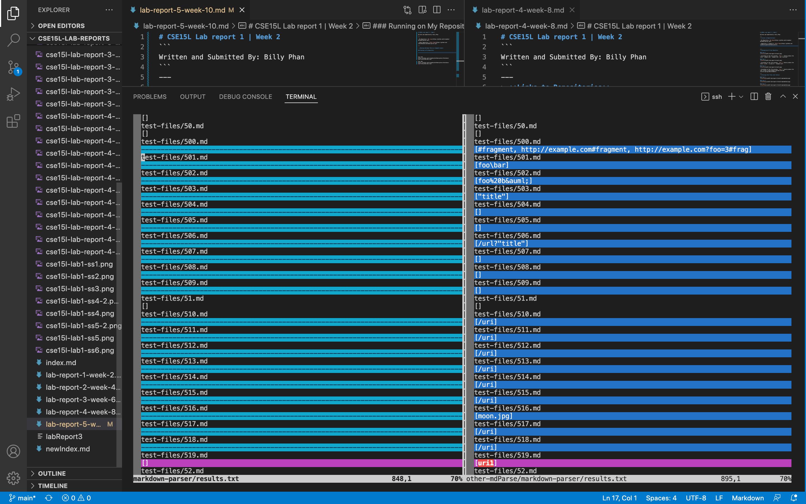
#### Links to test: [Test 502](https://github.com/b-ianphan/markdown-parser/blob/main/test-files/502.html.test)

#### Links to test: [Test 519](https://github.com/b-ianphan/markdown-parser/blob/main/test-files/519.html.test)

---

> **Regarding Tests 502 and 519**

### Test 502

* In test 502, the other implementation gives the correct output while mine does not.

 * Actual Outputs:
    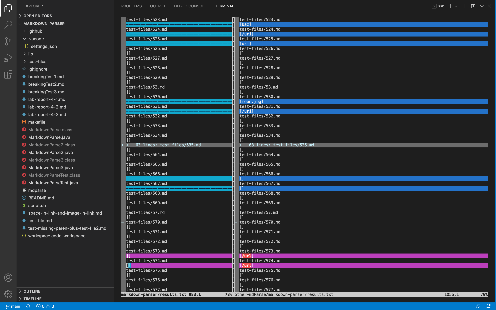
    * My output is on the left whilst the other is on the right

* The expected output should actually produce a link (what the other repository produces), as shown by the VScode preview.
    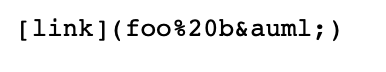
    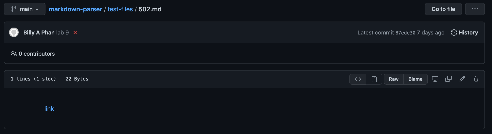

* For my implementation, I can deduce that it is simply not able to read non-alphabet letters. And thus, my implementation does not work as expected when they are in the paranthesis of test 502.
    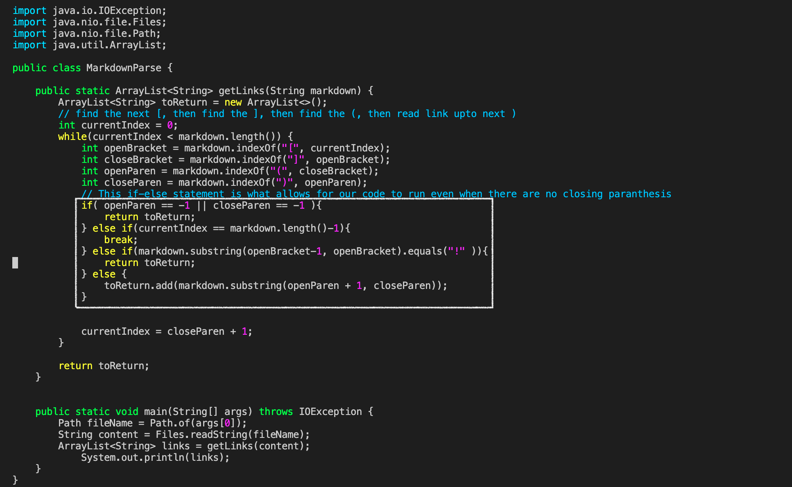

### Test 519

* In test 519, both implementations produce an incorrect output.

* Actual Outputs:
    
    * My output is on the left whilst the other is on the right

* The expected output should be nothing because as ashown by the VScode preview, test 519 produces an image, so a link should not be retrieved.
    
    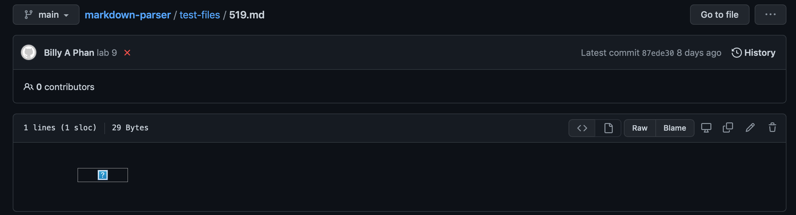

* For the other implementation, I can deduce that it does not take into consideration whether or not the `md file` contains an image or a link. Thus, when a image does appear, the `MarkdownParse.java` code in the other implementation may take an image instead of a link.
    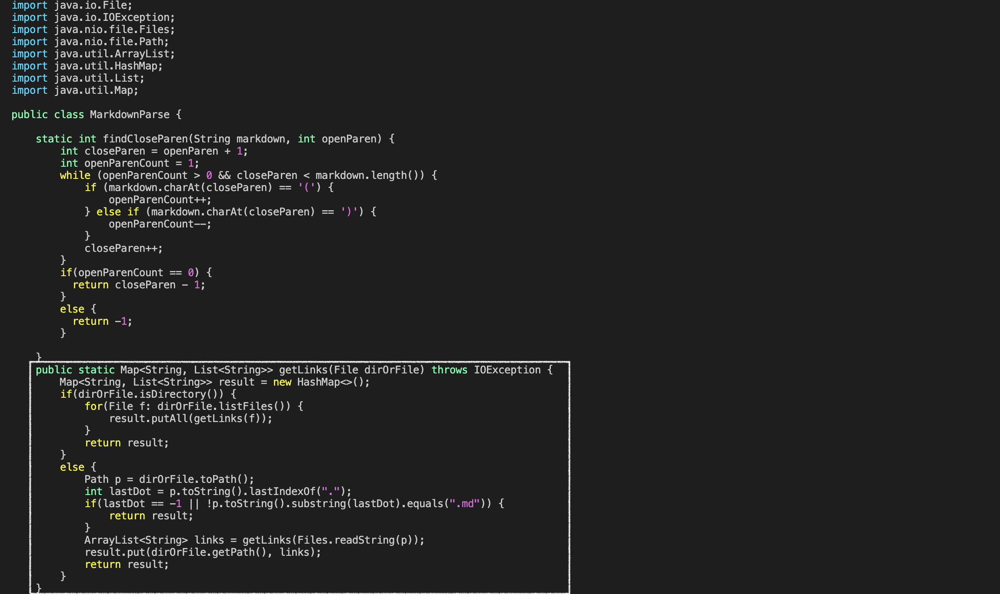
    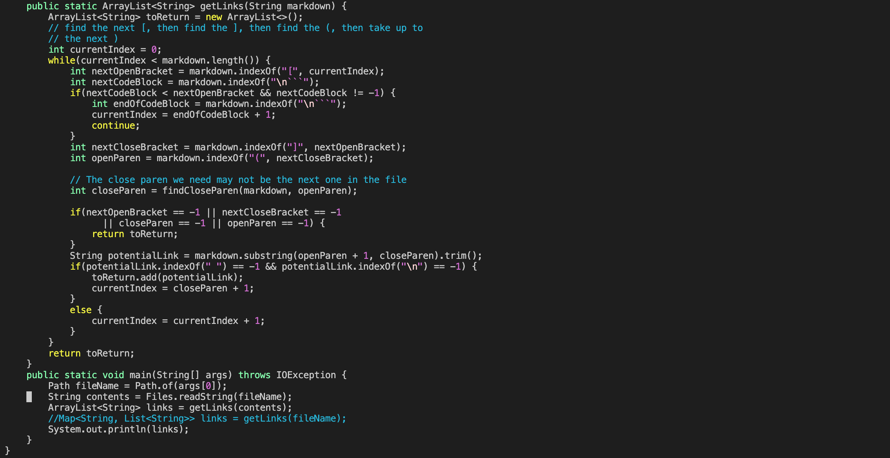
